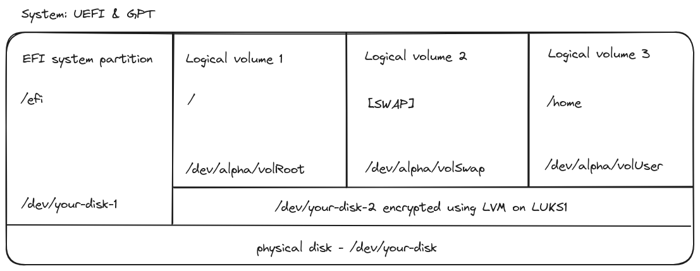

In this guide you’ll see how to setup a full disk encryption with Artix Linux (dinit) on your machine as well as rice the distro to be **secure**, **usefull** and **pretty**. It will contain detailed informations to guide you through the install process and more. For this guilde you will need
* A USB stick with 1GB in storage
* The machine you want to install Artix Linux. This wiki was created with a 1TB M2 SSD, AMD CPU and last generation Nvidia GPU in mind but can be used with any machine.
* An internet connection  

This guide was designed so it requires minium effort to follow but you'll still need the basics (such as exiting vim).  
Additionally, this guide was done using a french layout keyboard (AZERTY), thus you can skip or modify the sections regarding keyboard mapping.

***

## First steps

Download the ISO image on the official [Artix Linux website](https://artixlinux.org/download.php). We will choose the `artix-base-dinit-x86_64.iso` version to get Artix Linux with dinit. The partitions for our machine will be like the following

<br />

<br />

_Use this schema as reference if you're lost with what disk or partitions I use in the commands_

This approch is using LVM on LUKS to encrypt our entire system. We will also later on protect our `boot/efi` partition using the secure bios and an additional tool. This will provide maximum security for our data.

During this guide, I will reference the disk as either `/dev/your-disk` or a variant of this to indicate a specific partition. You will be able to see if your disk is `/dev/sda` for a hard drive or `/dev/nvme0n1` for an M.2 SSD or any other in the section about wiping your disk.

***

## Create a bootable USB

Locate the ISO you downloaded on your machine and use a tool like dd on Linux or Rufus on Windows to flash the usb.

Here is the command to flash the USB on Linux
```sh
sudo dd bs=4M if=path/to/artixlinux-version-x86_64.iso of=/dev/my-usb conv=fsync oflag=direct status=progress
```

Once the USB is flashed, plug the USB in your PC when it's shutdown, press the boot menu choice key or change the bootable order in your BIOS and boot onto the USB.

You might need to edit the GRUB boot options depending on your hardware or else you'll get a black screen once you loaded the live OS. Press e on the Stick/HDD option of the menu and add ‘nomodeset’ at the end of the line that starts with linux. 
```
linux ... nomodeset
```
Press f10 to boot. You should now have access to the root terminal of your live Artix Linux.

<br />
### Login

You can now login using the default credentials
```sh
username: root
password: artix
```

### Change your keyboard

Change your keyboard mapping if you didn't change the keytable in the GRUB options. Here is an example for the AZERTY layout
```sh
loadkeys fr
```

***

## Wipe your di(c)sk

This step ensure that you start with a fresh disk. You can use whatever disk manager tool you’re comfortable with. Be careful if you have data on this drive it **will be deleted**! You can list your partitions and disks by running:
```sh
lsblk
```

Wipe the data **⚠️ THIS WILL DELETE ALL THE DATA ON THE SELECTED DISK ⚠️**. This can take a long time depending on the size of your disk and your CPU.
```sh
dd bs=4096 if=/dev/urandom iflag=nocache of=/dev/your-disk oflag=direct status=progress || true
```
**WAIT** for the process to finish and run
```sh
sync
```

***

## Create the Partitions

Now that our disk has been reset to its original state, we're going to use a tool called parted to create our partitions. Let's install it
```sh
pacman -Syu
pacman -S parted
```

Create a GPT partition table
```sh
parted -s /dev/your-disk mklabel gpt
```
We're going to use the UEFI & GPT combo. The first partition is going to hold our bootloader and the rest will be encrypted using LVM on LUKS.

```sh
parted -s -a optimal /dev/your-disk mkpart "primary" "fat32" "0%" "512MiB"
parted -s /dev/your-disk set 1 esp on
parted -s -a optimal /dev/your-disk mkpart "primary" "ext4" "512MiB" "100%"
parted -s /dev/your-disk set 2 lvm on
```

You can print the partition table of the drive and see if the alignment of your partition is optimal
```sh
lsblk
parted -s /dev/your-disk align-check optimal 1
parted -s /dev/your-disk align-check optimal 2
```

***

## Cryptsetup

Now we're going to encrypt our disk. To get started run the next command to try to force the unlocking of stronger ciphers

```sh
cryptsetup benchmark
```
If that didn't work and you get an N/A on serpent-xts, try rebooting your live environment.

To generate a strong password, you can use this tool:
https://rumkin.com/tools/password/

Next we're going to encrypt the disk using one of the stronger cipher proposed by the benchmark.

```sh
cryptsetup --verbose --type luks1 --cipher serpent-xts-plain64 --key-size 512 --hash sha512 --iter-time 10000 --use-random --verify-passphrase luksFormat /dev/your-disk-2
```

Then we mount using the device mapper. A possible reboot here can fix issues mounting the partition.

```sh
cryptsetup luksOpen /dev/your-disk-2 alpha
```

***

## Logical & Physical volume

Now it's possible to create the physical volume

```sh
pvcreate /dev/mapper/alpha
```
And finally the logical volume that we'll call alpha

```sh
vgcreate alpha /dev/mapper/alpha
```

***

## System partitions

Next we can create the 3 partitions needed: swap user and root

```sh
lvcreate --contiguous y --size 16G alpha --name volSwap
lvcreate --contiguous y --size 400G alpha --name volUser
lvcreate --contiguous y --extents +100%FREE alpha --name volRoot
```

### Format the partitions

We can format each partition to use the correct file system.

```sh
mkfs.fat -n ESP -F 32 /dev/your-disk-1
mkswap -L SWAP /dev/alpha/volSwap
mkfs.ext4 -L ROOT /dev/alpha/volRoot
mkfs.ext4 -L HOME /dev/alpha/volUser
```

### Mount the partitions

We can finally mount our newly created partitions

```sh
swapon /dev/alpha/volSwap
mount /dev/alpha/volRoot /mnt
mkdir -p /mnt/boot/efi
mount /dev/your-disk-1 /mnt/boot/efi
mkdir /mnt/home
mount /dev/alpha/volUser
```

We did it! We can finally install Artix to our system.

***

## Install Artix

It's time to install all the necessary packages for your brand new os.

First we're going to install the base. I chose dinit but you can use runit openrc or s6 and I also added seatd instead of elogind
```sh
basestrap -i /mnt base base-devel dinit seatd seatd-dinit
```

Then we're going to chose linux-hardened for more security. We're also using seatd and turnstile instead of elogind. We're going to install turnstile later on.
(TODO: try booster instead of mkinitcpio)
```sh
basestrap -i /mnt linux-firmware linux-hardened linux-hardened-headers mkinitcpio dhcpcd dhcpcd-dinit openssh
```

And finally we're going to install additional packages
```sh
basestrap -i /mnt sudo vim git amd-ucode neofetch
```

Feel free to replace the amd-ucode with the necessary drivers for your CPU (intel-ucode). We're going to install GPU drivers later on.

### Fstab

Generate the fstab

```sh
fstabgen -U /mnt >> /mnt/etc/fstab
```

Ensure everything is listed correctly
```sh
cat /mnt/etc/fstab
```

If you're missing an entry, add it manually, for example this is the command to add your /home
```sh
echo -e "# /dev/mapper/alpha-volUser LABEL=HOME\nUUID=`blkid -s UUID -o value /dev/alpha/volUser`\t/home\t\text4\t\trw,relatime\t0 2\n" | tee -a /mnt/etc/fstab
```

#### Optional

tmpfs is a temporary filesystem that resides in memory or swap partitions. Without systemd, only the /run directory uses tmpfs by default. We can change the size of tmpfs partition using this command
```sh
echo -e "\ntmpfs\t\t\t\t\t\t/tmp\t\ttmpfs\t\trw,nosuid,nodev,relatime,size=8G,mode=1777\t0 0\n" | tee -a /mnt/etc/fstab
```

### Chroot

```sh
artix-chroot /mnt /bin/bash
```

Set your new root password

```sh
passwd
```

### Locale, Timezone, Hostname and Hosts

First we need to generate our local. It is recommanded to use en_US

```sh
echo -e "en_US.UTF-8 UTF-8" >> /etc/locale.gen
locale-gen
echo "LANG=en_US.UTF-8" > /etc/locale.conf
export LANG=en_US.UTF-8
```

Then we need to switch our timezone

```sh
ln -s /usr/share/zoneinfo/your-continent/your-city /etc/localetime
hwclock --systohc
```

Setup your hostname, in this example "Artix"

```sh
echo "Artix" > /etc/hostname
```

And finally we need to add our static hosts

```sh
vim /etc/hosts
```

And insert this

```
127.0.0.1    localhost
::1          localhost
127.0.1.1    myhostname.localdomain    myhostname
```

#### Optional

Add your keymaps in vconsole
```sh
echo "KEYMAP=fr" > /etc/vconsole.conf
```

### User account

Next we're going to create a user account
```sh
useradd -m myuser
passwd myuser
usermod -aG wheel,storage,power myuser
```

We need to enable the use of sudo. To do that execute
```sh
EDITOR=vim visudo
```
And go to line 108 and uncomment this line
```
%wheel ALL=(ALL:ALL) ALL
```

### Kernel parameters

```sh
pacman -S cryptsetup lvm2 lvm2-dinit
dinitctl enable lvm2
```

```sh
vim /etc/mkinitcpio.conf
```

And insert encrypt lvm2 and resume between the block and filesystems parameters

```sh
HOOKS=(base udev autodetect modconf kms keyboard keymap consolefont block filesystems fsck)
```
Should become
```sh
HOOKS=(base udev autodetect modconf kms keyboard keymap consolefont block encrypt lvm2 resume filesystems fsck)
```

Next, we will create a key to decrypt our disk during boot by our bootloader. If we don't do that, we will be prompted for our encryption key twice instead of one directly on boot. The default path for that key is `/crypto_keyfile.bin`. **BE CAREFUL** to never leak this key because it can fully decrypt your disk. We will generate it like this
```sh
dd if=/dev/random of=/crypto_keyfile.bin bs=512 count=8 iflag=fullblock
chmod 000 /crypto_keyfile.bin
```

Add the file to the `FILES` hook of `/etc/mkinitcpio.conf` and register your key.
```
sed -i "s/FILES=(/FILES=(\/crypto_keyfile.bin/g" /etc/mkinitcpio.conf
cryptsetup luksAddKey /dev/your-disk-2 /crypto_keyfile.bin
```

Compile the image and you're ready to go
```sh
mkinitcpio -p linux-hardened
```

We should get a successfull image generation

***

## GRUB

Let's install GRUB
```sh
pacman -S grub efibootmgr
```

Run this command to add the correct configuration. Make sure you reference the correct lvm partition (it should be your second one)
```sh
sed -i "s/^GRUB_CMDLINE_LINUX_DEFAULT=.*/GRUB_CMDLINE_LINUX_DEFAULT=\"cryptdevice=UUID=`blkid -s UUID -o value /dev/your-disk-2`:alpha loglevel=3 quiet resume=UUID=`blkid -s UUID -o value /dev/alpha/volSwap` net.iframes=0\"/" /etc/default/grub
```

Next open the file and check if the output of the previous command is correct
```sh
vim /etc/default/grub
```

Then uncomment this line
```
GRUB_ENABLE_CRYPTODISK="y"
```

And add to GRUB_PRELOAD_MODULES cryptodisk
```
GRUB_PRELOAD_MODULES="cryptodisk part_gpt part_msdos"
```

Save the file and run the next two commands to install and generate the config
```sh
grub-install --target=x86_64-efi --efi-directory=/boot/efi --bootloader-id=artix --recheck /dev/your-disk
grub-mkconfig -o /boot/grub/grub.cfg
```

Check the output of the command to see if it used our linux-hardened image we created earlier

#### Optional: Set GRUB keyboard layout

If you're using something other than the default US keyboard, you're going have to generate a keymap for GRUB to use.

First, you're going to need to setup the AUR repositories. Check [this page](https://github.com/Sawangg/dotfiles/wiki/Manage-your-packages#aur) of the wiki.
Next, we're going to add this package
```sh
yay -S ckbcomp
```

We're going to add this line to our default grub
```sh
echo "GRUB_TERMINAL_INPUT=at_keyboard" | tee -a /etc/default/grub
```

Open `/etc/grub.d/40_custom` and paste those lines
```sh
insmod keylayouts
keymap /boot/grub/fr.gkb
```

Then generate the keymap and update GRUB
```sh
grub-kbdcomp -o /boot/grub/fr.gkb fr
update-grub
```

Voila, you should have your custom keymap on your next reboot

***

## Boot Time !

It seems like we can now boot into our system.

Exit the termnial, unmount the partitions and reboot !

```sh
exit
umount -R /mnt
swapoff -a
sync
reboot
```

***

## Connect to the internet

Because we didn't install `networkmanager`, we're going to enable the `dhcpcd` service as root to get an ip adress
```sh
dinitctl enable dhcpcd
```

Once it started, change your dns to whatever you want (don't use Google please). You can prevent the file from being updated if you want your DNS configuration to be persistent.
```sh
vim /etc/resolv.conf
chattr +i /etc/resolv.conf
```

You're DONE !! Congratulation, you're well on your way to have a secure system. See the [next article](https://github.com/Sawangg/dotfiles/wiki/Enhance-security) of this guide to upgrade the security of your newly installed system.


